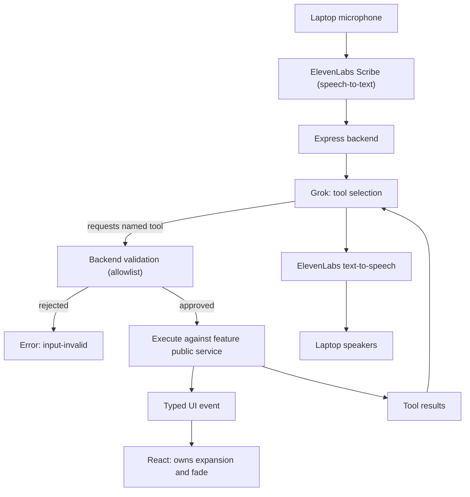
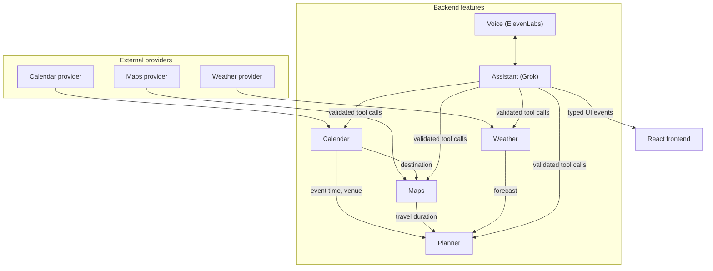

# Architecture

**Status:** The assistant tool loop matches the speech pipeline below. Express composition, voice, and event transport are not implemented.

Source of truth for the rules below is [`AGENTS.md`](../AGENTS.md). This document expands the
data flow and integration boundaries.

## Speech pipeline

Two things to notice in that loop:

- Grok **requests**; the backend **validates and executes**. The model never runs anything
  directly.
- Tool results go **back to Grok** before it speaks a factual recommendation. It does not
  narrate a forecast it has not received.

A single turn can carry both a UI action and an information request — "expand weather and
recommend what I should wear" expands the widget *and* fetches the forecast.

## Feature boundaries

Every arrow crosses a **public interface**. No feature imports another's provider adapter, and
third-party response shapes never escape the adapter that owns them.

The planner is deliberately its own feature. It consumes normalized outputs and makes **no
external API requests of its own**.

The overview assembles results without duplicating provider logic.

## Determinism: what Grok may and may not do

| Concern | Owner |
|---|---|
| Task windows | Deterministic backend code |
| Event deadlines | Deterministic backend code |
| Travel buffers | Deterministic backend code |
| Schedule feasibility | Deterministic backend code |
| Intent selection | Grok, via a bounded tool list |
| Response wording | Grok |
| Explaining a conflict | Grok, describing a computed result |

All time arithmetic is **time-zone aware**. The system works from **relative current time**,
never a hardcoded clock value, and reads "now" through the demo/test-time override so noon,
2 PM, 3:30 PM, and 4 PM are all testable.

## Secrets

Grok, ElevenLabs, maps, and calendar keys stay **server-side**. Never in a React bundle,
never in Git, never in documentation. The frontend reaches providers only through the backend.

An `.env.example` with **names only** comes later; until then, variable names are tracked in
[`backend/src/shared/config/`](../backend/src/shared/config/README.md).

## Degradation

The app must stay usable when something is missing. Each failure is scoped to its own feature.

| Failure | Behavior |
|---|---|
| No internet | Show cached or fixture-labeled state, clearly marked; never invent live data |
| Provider unavailable | That module shows an error state; the rest of the mirror still works |
| Credentials missing | That feature reports `not-configured`; the server still starts |
| Microphone denied | Fall back to on-screen controls; offer retry |
| Voice recognition fails | Visible failure with a retry affordance |
| One feature broken | Other modules continue; the overview renders what it has |

Never substitute fabricated live data for an error state.

## Integration boundary

Two directories are **integration-owned** and have a single owner:

- [`backend/src/app/`](../backend/src/app/README.md) — the one Express composition point.
- [`backend/src/shared/events/`](../backend/src/shared/events/README.md) — the UI event
  transport.

Everyone else requests changes there or coordinates a short integration session. This is the
main mechanism keeping two concurrent developers out of the same file.

## Open architectural questions

- Backend-to-frontend transport: WebSocket or server-sent events. One choice, before
  implementation.
- Whether voice gets a dedicated API namespace or integrated session endpoints.
- Where time utilities live — `backend/src/shared/utils/` or the planner feature.
- When SQLite enters, if at all. It is explicitly **not** part of the current scope.

Track these in [`decisions.md`](decisions.md).
